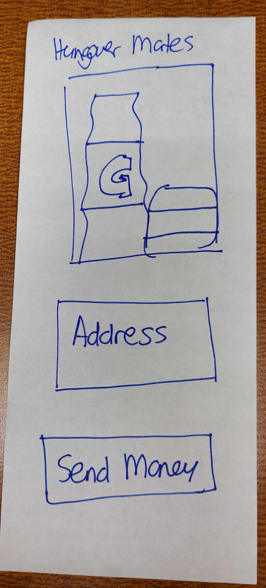

# Hunger Mate

  

 

## Table of Contents

- [Description](#description)
- [Installation](#installation)
- [Features](#features)
- [Contributions](#contributions)
- [Licenses](#licenses)
- [Contact](#contact)

## Description

Hunger mate is your hangover buddy. 

## Installation
undefined
 

## Features
Finding delicious, greasy/nutritious food for hangovers.
 

## Contributions
[cmccray87](https://github.com/cmccray87) 
[ddcrane](https://github.com/ddcrane) 
[hucklebun](https://github.com/HuckleBun) 
[missystiner](https://github.com/missystiner) 
[ultimateojo](https://github.com/ultimateojo) 

## Testing

## Licenses

## Contact
Contact me : <a href="mailto:cody.mccray87@gmail.com">cody.mccray87@gmail.com</a>
 
Github : <a href="https://github.com/cmccray87">cmccray87</a>
